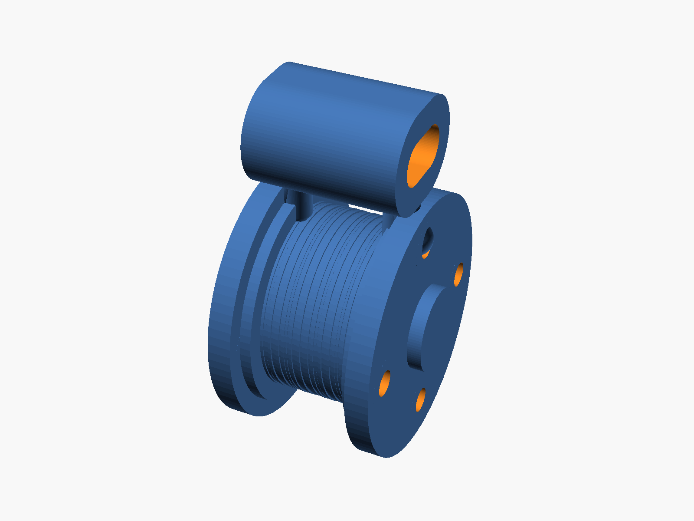
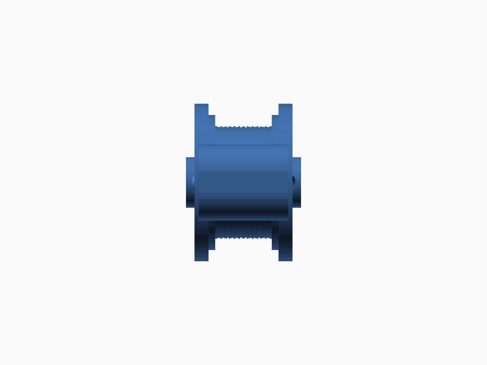

# controlleddescent

Parametric OpenSCAD model for a compact, one-piece friction pulley assembly sized for light-duty rope handling.

## Files

- `friction_pulley.scad` — parametric CAD source
- `renders/friction_pulley_isometric.png` — isometric render
- `renders/friction_pulley_front.png` — front render
- `renders/friction_pulley_top.png` — top render

## Renders

| Isometric | Front | Top |
| --- | --- | --- |
|  |  |  |

## Design summary

The model implements:

- a flat 1.00 in rope-contact drum
- raised side flanges to retain multiple rope wraps
- an integral shaft and two rigidly connected outer plates
- reinforced through-holes on a bolt circle in both plates
- a closed eyelet above the pulley body for hanging
- generous radiused transitions for printed strength

Units in the OpenSCAD file are millimeters, with inch-based design inputs converted internally.

## Usage

Open `friction_pulley.scad` in OpenSCAD, adjust the top-level parameters if needed, then render and export STL/3MF.

## Safety note

This model is intended only for light-duty, non-life-safety use. Do not use it for climbing, lifting people, overhead safety-critical loads, or shock loading.
